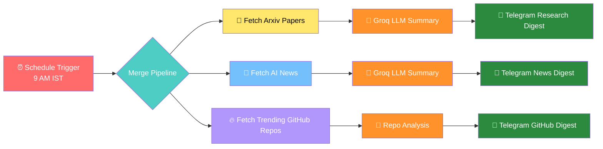
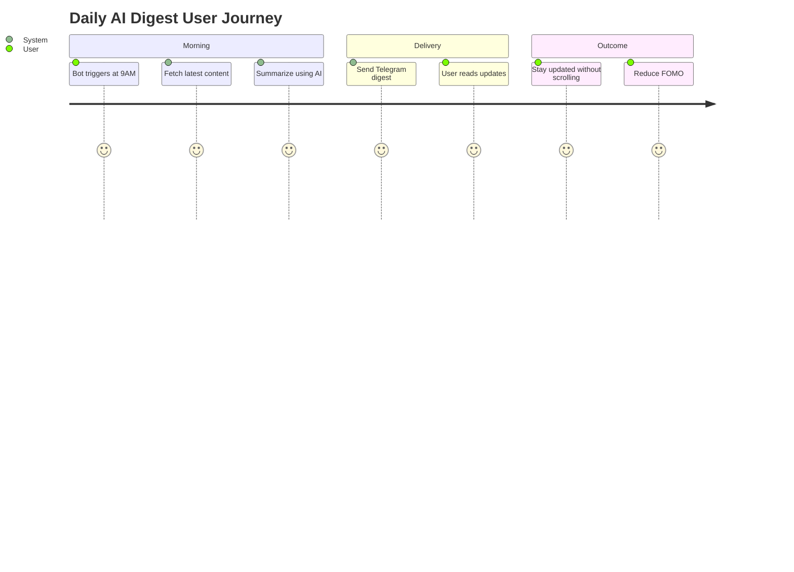

# 🚀 9AM IST AI Daily Digest (Arxiv + GitHub + News)

<div align="center">


### 📚 Daily AI Research + 📰 Tech News + 🔥 Trending GitHub Repositories  
### Delivered Automatically Every Day at **9 AM IST**

</div>

---

# 🌍 Why This Project Exists

The AI ecosystem is evolving at an insane speed.

Every single day:
- New research papers are published 📄
- New AI startups/tools launch 🚀
- New breakthroughs happen 🤖
- New open-source GitHub repositories trend 🔥
- New AI news floods the internet 📰

For students, developers, researchers, and AI enthusiasts, this creates a massive problem:

# 😰 FOMO (Fear Of Missing Out)

There is simply too much information.

Most people:
- Cannot track everything manually
- Waste time scrolling through noise
- Miss important breakthroughs
- Struggle to find genuinely useful updates

---

# 💡 Solution

This project automates the entire process.

Every day at **9 AM IST**, the workflow automatically:

✅ Fetches top AI research papers from Arxiv  
✅ Fetches latest AI/ML tech news  
✅ Fetches trending GitHub repositories  
✅ Summarizes everything using LLMs  
✅ Sends a clean digest directly to Telegram  

So instead of reading hundreds of posts...

You only consume:
- What matters
- What is trending
- What is valuable

---

# ✨ Features

## 📄 Research Paper Digest
Get:
- Top AI/ML research papers
- Short 2–3 line summaries
- Direct paper/PDF links
- Easy-to-read format

---

## 📰 AI & Tech News
Receive:
- Breaking AI news
- Startup launches
- OpenAI/Google/Meta updates
- Industry developments
- Short AI-generated summaries

---

## 🔥 Trending GitHub Repositories
Discover:
- Fast-growing AI repos
- Viral open-source projects
- Useful developer tools
- New frameworks/libraries

Includes:
- Repository name
- What it does
- Why it matters
- GitHub link

---

# 📲 Telegram Access

The service is completely FREE.

## 🤖 Bot Username

```txt
@AINEWSFEED247_BOT
```

## 🔗 Direct Link

👉 https://t.me/AINEWSFEED247_BOT

Simply open Telegram and start the bot.

You will automatically start receiving daily updates.

---

# 🧠 Tech Stack

| Component | Purpose |
|---|---|
| n8n | Workflow automation |
| Groq LLM | AI summarization |
| Arxiv API | Research papers |
| NewsAPI | AI/Tech news |
| Tavily API | Trending GitHub repositories |
| Telegram Bot API | Message delivery |

---

# 🏗️ Workflow Architecture

## 🔄 Complete Workflow



---

# ⚙️ Detailed Workflow Explanation

## 1️⃣ Schedule Trigger
The automation starts automatically every day at:

```txt
9:00 AM IST
```

No manual execution required.

---

## 2️⃣ Research Paper Collection

The workflow:
- Connects with Arxiv API
- Fetches latest AI/ML papers
- Filters relevant content
- Sends papers to the LLM

### Example Topics
- LLMs
- Agents
- RAG
- Vision Models
- Robotics
- AI Safety
- Multimodal AI

---

## 3️⃣ AI News Collection

The workflow fetches:
- AI startup news
- Model launches
- Industry announcements
- Big tech AI updates
- AI regulation updates

Using:
```txt
NewsAPI
```

---

## 4️⃣ GitHub Trend Discovery

Using Tavily API:
- Searches latest trending AI repos
- Extracts repository information
- Filters useful projects
- Removes noisy repositories

---

## 5️⃣ AI Summarization Layer

The brain of the system.

Powered by:
```txt
Groq LLM
```

The model:
- Reads raw content
- Generates concise summaries
- Extracts key insights
- Makes content beginner-friendly

---

## 6️⃣ Telegram Delivery

Finally:
- Clean formatted messages are generated
- Content is organized into sections
- Messages are delivered directly to Telegram

---

# 🖼️ Screenshots


## 📲 Telegram Output


---

# 📦 Folder Structure

```txt
AI-Daily-Digest/
│
├── README.md
├── workflow/
│   └── ai-daily-digest.json
│
├── Screenshots/
│   ├── Telegram_Bot.jpg
│   ├── telegram-1.png
│   ├── telegram-2.png
│   └── telegram-3.png
│
└── docs/
    └── setup-guide.md
```

---

# 🚀 How To Use

## 1️⃣ Clone Repository

```bash
git clone https://github.com/shubham001official/AI-Daily-Digest.git
```

---

## 2️⃣ Import Workflow Into n8n

- Open n8n
- Click "Import Workflow"
- Select:
```txt
ai-daily-digest.json
```

---

## 3️⃣ Add API Keys

Configure:
- Groq API Key
- NewsAPI Key
- Tavily API Key
- Telegram Bot Token

---

## 4️⃣ Activate Workflow

Turn workflow ON.

Done ✅

Now the bot will automatically run daily.

---

# 🔐 Required Environment Variables

```env
GROQ_API_KEY=
NEWS_API_KEY=
TAVILY_API_KEY=
TELEGRAM_BOT_TOKEN=
```

---

# 📈 Future Improvements

Planned features:

- [ ] Personalized topic preferences
- [ ] AI Tool recommendations
- [ ] YouTube AI video digest
- [ ] Twitter/X AI trend analysis
- [ ] AI startup funding tracker
- [ ] Multi-language summaries
- [ ] Voice summaries
- [ ] Email newsletter support
- [ ] Discord integration
- [ ] WhatsApp integration
- [ ] AI Agents section
- [ ] HuggingFace trending models
- [ ] Papers With Code integration

---

# 🎯 Ideal Users

This project is useful for:

- Students 👨‍🎓
- AI Enthusiasts 🤖
- Researchers 📚
- Developers 💻
- Startup Founders 🚀
- Data Scientists 📊
- ML Engineers 🧠
- Tech Communities 🌍

---

# 🌟 Key Benefits

✅ Saves Time  
✅ Reduces Information Overload  
✅ Eliminates Noise  
✅ Keeps You Updated Daily  
✅ Beginner Friendly  
✅ Fully Automated  
✅ Free To Use  

---

# 🧩 Example Daily Flow



---

# 📊 Data Sources

| Source | Usage |
|---|---|
| Arxiv | Research papers |
| NewsAPI | AI news |
| Tavily | GitHub repo discovery |
| Groq | AI summarization |
| Telegram | Message delivery |

---

# 🔥 What Makes This Different?

Instead of:
- Endless scrolling
- Twitter/X overload
- Random YouTube recommendations
- Information chaos

You receive:
- Curated updates
- Clean summaries
- Actionable insights
- Signal over noise

---

# 🤝 Contributions

Contributions are welcome.

Ideas, improvements, and feature suggestions are highly appreciated.

Feel free to:
- Fork the repo
- Open issues
- Submit PRs

---

# ⭐ Support

If you found this project useful:

⭐ Star the repository  
🍴 Fork the project  
📢 Share with friends  

---

# 📜 License

MIT License

---

# 👨‍💻 Author

Built with ❤️ using n8n + AI Automation

---

# 🚀 Final Vision

The vision is simple:

> Build a free AI-powered ecosystem that helps people stay updated with the fast-moving AI world — without drowning in noise.
